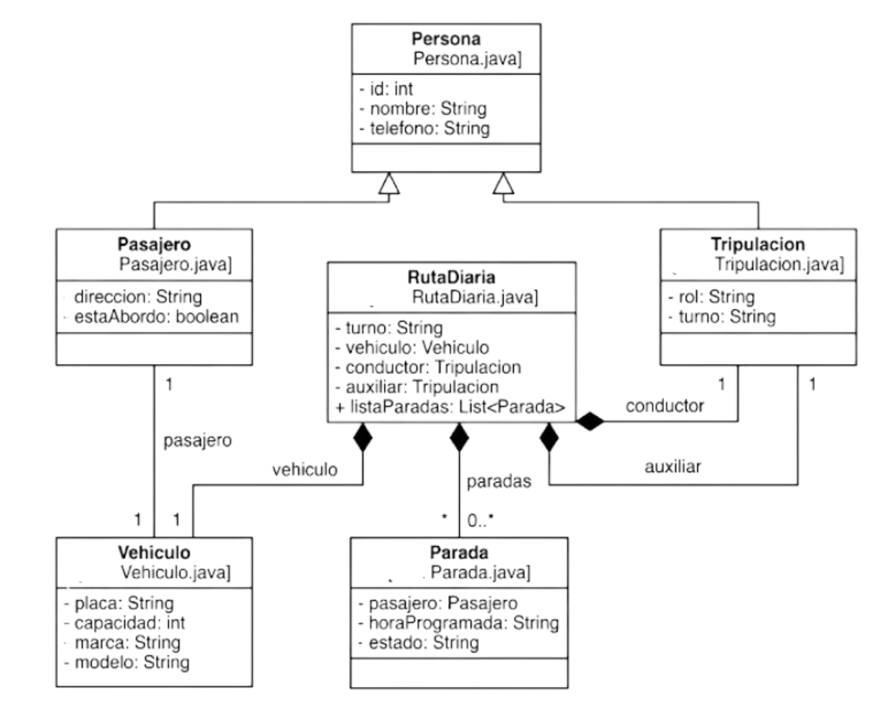

Proyecto RutaAlejo - Gestión de Transporte Escolar

Este proyecto es una aplicación en Java diseñada para organizar la logística diaria de una ruta escolar (Colegio Colombo Francés). El objetivo es aplicar los fundamentos de la Programación Orientada a Objetos.

Estructura Técnica del Código:
- **Herencia:** Se utiliza una clase base Persona para los datos comunes, de la cual heredan Pasajero (estudiantes) y Tripulacion (conductor y auxiliar).
- **Encapsulamiento:** Todos los datos están protegidos con atributos privados y se acceden mediante métodos Getter y Setter.
- **Composición:** La clase RutaDiaria funciona como el núcleo del sistema, agrupando objetos de las clases Vehiculo, Tripulacion y una lista de Parada.
- **Lógica de Negocio:** El sistema permite registrar el abordaje de los estudiantes y actualizar el estado de la ruta en tiempo real.

Diagrama de Clases UML
Aquí se puede ver cómo interactúan todas las piezas del sistema:

